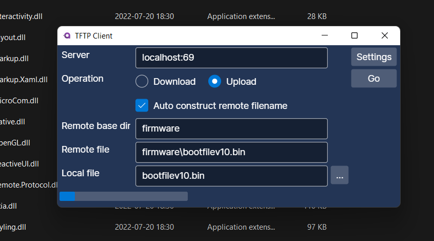

# Avalonia-TFTPClient
Cross platform Trivial File Transfer Protocol (TFTP) client desktop application, uses [Avalonia UI](https://github.com/AvaloniaUI) as the UI framework.

It relies on my TFTP protocol client library Baksteen.Net.TFTP.Client ; see the [Nuget package](https://www.nuget.org/packages/Baksteen.Net.TFTP.Client) or [repository](http://github.com/jpmikkers/TFTPClient) for more information.

# Screenshots

## TFTP Client running on win11

